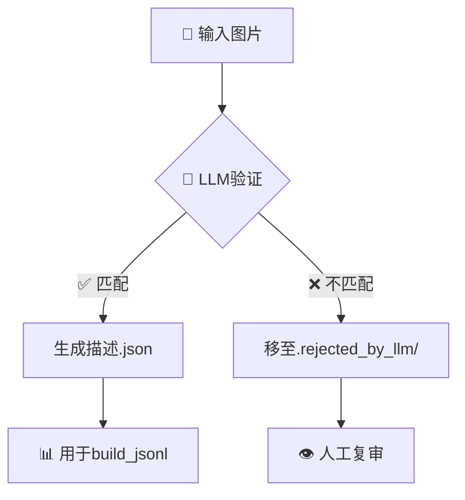

<div align="center">

# 🌾 农业多模态视觉数据集整合

<p align="center">
  <strong>高质量 · 大规模 · 多模态</strong><br>
  为视觉语言模型训练而生的农业知识库
</p>

<p align="center">
  <a href="#-特性亮点">特性</a> •
  <a href="#-快速开始">快速开始</a> •
  <a href="#-数据流水线">流水线</a> •
  <a href="#-文档">文档</a> •
  <a href="#-贡献">贡献</a>
</p>

<p align="center">
  
  
  
  
  
  
</p>

<p align="center">
  
  
  
</p>

<br>

</div>

---

## 📦 数据发布与获取（重要说明）

- 本仓库暂不附带完整数据集，原因：体量较大（数十万张图片，多模态标注）。
- 我们将于近期在 Hugging Face Hub 发布公开版本的数据集（含 JSONL 索引与示例）。
- 发布后会在本 README 置顶更新下载链接与获取方式：`https://huggingface.co/datasets/<org>/<dataset_name>`（占位）。
- 目前可使用 `data.sample.jsonl` 与配套脚本复现流程或自建数据；完整结构与规范见 `docs/documentation.md`。

## 🎯 项目愿景

> 从单一的图像分类到丰富的多模态理解

传统农业数据集仅提供 **图像 + 标签**，而本项目构建的是一个完整的**知识库**：

```
传统数据集:  🖼️ Image → 🏷️ Label
本项目:     🖼️ Image → 📝 Caption → 💬 VQA → 🏷️ Structured Labels → 🔍 Traceability
```

<table>
<tr>
<td width="50%">

### 🎨 多模态标注
- 中英双语图像描述
- 视觉问答对（VQA）
- 结构化标签体系

</td>
<td width="50%">

### 🎓 学术级质量
- 多维度去重算法
- 模糊检测与过滤
- LLM语义验证

</td>
</tr>
<tr>
<td width="50%">

### 🌐 完整溯源
- 标准化命名规范
- 数据源可追溯
- 版权清晰合规

</td>
<td width="50%">

### 🤖 AI驱动
- 自动化处理流程
- 并发LLM增强
- Web审核界面

</td>
</tr>
</table>

---

## ✨ 特性亮点

<div align="center">

| 🏗️ 统一本体 | 🔍 质量控制 | 🚀 自动化 | 📊 可视化 |
|:---:|:---:|:---:|:---:|
| 跨数据源<br>标准化体系 | 感知哈希<br>模糊检测 | 一键式<br>处理流程 | Web界面<br>人工审核 |
| 中英双语<br>学名映射 | 尺寸过滤<br>LLM验证 | 并发处理<br>高效能 | 实时统计<br>进度追踪 |

</div>

---

## 📊 数据集概览

<div align="center">

### 📈 数据规模（持续增长中）

</div>

```
🌱 作物 (Crops)          📊 140+ 类别    🖼️  80,000+ 张
🐛 害虫 (Pests)          📊  30+ 类别    🖼️  15,000+ 张  
🍂 病害 (Diseases)       📊  50+ 类别    🖼️ 120,000+ 张
━━━━━━━━━━━━━━━━━━━━━━━━━━━━━━━━━━━━━━━━━━━━━━━
📦 总计                 📊 220+ 类别    🖼️ 215,000+ 张
```

<div align="center">

### 🗂️ 数据源

</div>

<table align="center">
<tr>
<th>数据源</th>
<th>类型</th>
<th>特点</th>
<th>标识</th>
</tr>
<tr>
<td>🏛️ <b>PlantDoc</b></td>
<td>专业数据集</td>
<td>植物病害，高质量标注</td>
<td><code>pd</code></td>
</tr>
<tr>
<td>🏆 <b>Kaggle</b></td>
<td>竞赛数据集</td>
<td>多源聚合，品类丰富</td>
<td><code>kaggle</code></td>
</tr>
<tr>
<td>🌍 <b>GBIF/iNaturalist</b></td>
<td>生物学数据库</td>
<td>学名准确，专业级</td>
<td><code>web</code></td>
</tr>
<tr>
<td>📷 <b>Unsplash</b></td>
<td>高质量图片</td>
<td>美学优秀，通用场景</td>
<td><code>web</code></td>
</tr>
</table>

---

## 🚀 快速开始

<details open>
<summary><b>📦 1. 安装依赖</b></summary>

```bash
# 克隆项目
git clone https://github.com/your-repo/dataset_web.git
cd dataset_web

# 安装依赖
pip install -r requirements.txt
```

</details>

<details open>
<summary><b>⚙️ 2. 配置环境（可选）</b></summary>

```bash
# 创建配置文件（用于LLM增强功能）
cat > .env.llm << EOF
VLM_API_KEY=sk-your-api-key-here
VLM_API_BASE=https://xmdbd.online/v1
VLM_MODEL=gemini-2.5-flash
VLM_WORKERS=8
EOF

# 载入环境变量
export $(grep -v '^#' .env.llm | xargs)
```

</details>

<details open>
<summary><b>🎬 3. 运行演示</b></summary>

```bash
# 统计当前数据集
python3 scripts/03_cleaning/count_images_by_class.py \
    --roots datasets/diseases datasets/crops datasets/pests

# 查看示例数据
head -n 5 data.sample.jsonl | jq
```

</details>

---

## 🔄 数据流水线

<div align="center">


</div>

### 🎯 阶段 1: 数据采集

<table>
<tr>
<td width="50%">

#### 📁 本地数据合并

```bash
# 合并已有数据集
python3 scripts/02_ingest_and_merge/merge_crop_diseases.py
python3 scripts/02_ingest_and_merge/merge_140_crops.py
python3 scripts/02_ingest_and_merge/merge_kaggle_disease.py
```

</td>
<td width="50%">

#### 🌐 网络爬虫采集

```bash
# GBIF/iNaturalist 爬虫
cd web_scraper
scrapy crawl agri_sites \
  -a keywords_file=keywords.txt \
  -a max_api_results=150
```

</td>
</tr>
</table>

### 🎯 阶段 2: 标准化处理

<details>
<summary><b>📝 文件名标准化</b></summary>

```bash
python3 scripts/03_cleaning/bulk_rename_by_class.py \
    --root datasets/diseases \
    --tag pd
```

**命名规范**: `<类别>__<来源>__<uuid>.<ext>`

**示例**: `corn_rust_leaf__pd__a3f2e1b9.jpg`

</details>

### 🎯 阶段 3: 质量控制

<details>
<summary><b>🔍 智能去重与过滤</b></summary>

```bash
python3 scripts/03_cleaning/deduplicate_images.py \
    --roots datasets/diseases datasets/crops datasets/pests \
    --min-width 224 --min-height 224 \
    --blur-method both \
    --blur-threshold 60 \
    --tenengrad-threshold 700 \
    --ham-threshold 3 \
    --near-scope class \
    --action move
```

<table>
<tr>
<th>检测算法</th>
<th>阈值</th>
<th>说明</th>
</tr>
<tr>
<td>🖼️ 感知哈希</td>
<td>≤3</td>
<td>基于视觉相似度的去重</td>
</tr>
<tr>
<td>📐 平均哈希</td>
<td>≤3</td>
<td>快速粗粒度去重</td>
</tr>
<tr>
<td>🌫️ Laplacian</td>
<td>&lt;60</td>
<td>检测模糊图像</td>
</tr>
<tr>
<td>🔬 Tenengrad</td>
<td>&lt;700</td>
<td>梯度方差模糊检测</td>
</tr>
<tr>
<td>📏 尺寸过滤</td>
<td>224×224</td>
<td>最小分辨率要求</td>
</tr>
</table>

</details>

<details>
<summary><b>👁️ 人工审核界面</b></summary>

```bash
# 启动Web审核服务器
python3 scripts/03_cleaning/pest_review_server.py \
    --root web_scraper/scraped_images

# 浏览器打开审核页面
open docs/pest_manual_review.html
```

**特性**:
- ✅ 可视化批量审核
- ✅ 按类别分组查看
- ✅ 快速标记通过/剔除
- ✅ 导出审核结果JSON

</details>

### 🎯 阶段 4: LLM增强（可选）

<details>
<summary><b>🤖 语义验证与描述增强</b></summary>

```bash
# 干跑模式（仅日志，不修改文件）
python3 llm_tools/verify_and_describe.py \
    --root datasets/diseases \
    --action dry-run \
    --workers 8

# 实际运行
python3 llm_tools/verify_and_describe.py \
    --root datasets/diseases \
    --model gemini-2.5-flash \
    --workers 8 \
    --insecure
```

**工作流程**:



</details>

### 🎯 阶段 5: 生成索引

<details>
<summary><b>📊 生成JSONL数据索引</b></summary>

```bash
python3 scripts/05_index_and_stats/build_jsonl.py \
    --roots datasets/diseases datasets/crops datasets/pests \
    --out data.jsonl \
    --train 0.8 --val 0.1 --test 0.1 \
    --seed 42
```

**输出格式**:

```json
{
  "image": "datasets/diseases/corn_rust_leaf__pd__a3f2e1b9.jpg",
  "task": "caption",
  "text": "这是一张玉米锈病叶片的照片。This is a photo of corn rust leaf.",
  "split": "train",
  "labels": {
    "category": "diseases",
    "crop": "corn",
    "disease": "rust",
    "source": "pd",
    "class": "corn rust leaf"
  }
}
```

</details>

---

## 🛠️ 工具箱

<div align="center">

### 核心脚本一览

</div>

<table>
<tr>
<th>类别</th>
<th>脚本</th>
<th>功能</th>
<th>关键参数</th>
</tr>
<tr>
<td rowspan="3">📦 <b>数据合并</b></td>
<td><code>merge_crop_diseases.py</code></td>
<td>合并Crop Diseases数据集</td>
<td>-</td>
</tr>
<tr>
<td><code>merge_140_crops.py</code></td>
<td>合并140 Crops数据集</td>
<td>-</td>
</tr>
<tr>
<td><code>merge_kaggle_disease.py</code></td>
<td>合并Kaggle病害数据集</td>
<td>-</td>
</tr>
<tr>
<td rowspan="3">🔧 <b>数据处理</b></td>
<td><code>bulk_rename_by_class.py</code></td>
<td>批量规范化文件名</td>
<td><code>--root --tag</code></td>
</tr>
<tr>
<td><code>deduplicate_images.py</code></td>
<td>智能去重与质量过滤</td>
<td><code>--roots --action</code></td>
</tr>
<tr>
<td><code>count_images_by_class.py</code></td>
<td>统计各类别数量</td>
<td><code>--roots</code></td>
</tr>
<tr>
<td rowspan="3">👁️ <b>审核工具</b></td>
<td><code>pest_review_server.py</code></td>
<td>启动Web审核服务器</td>
<td><code>--root --port</code></td>
</tr>
<tr>
<td><code>generate_pest_review_manifest.py</code></td>
<td>生成审核清单</td>
<td><code>--root --out</code></td>
</tr>
<tr>
<td><code>import_reviewed_pests.py</code></td>
<td>导入审核通过的数据</td>
<td><code>--review-json --tag</code></td>
</tr>
<tr>
<td rowspan="2">🤖 <b>AI增强</b></td>
<td><code>verify_and_describe.py</code></td>
<td>LLM语义验证与描述增强</td>
<td><code>--root --workers</code></td>
</tr>
<tr>
<td><code>build_jsonl.py</code></td>
<td>生成JSONL索引</td>
<td><code>--roots --out</code></td>
</tr>
</table>

> 💡 **提示**: 所有脚本均支持 `--help` 查看详细用法

---

## 📁 项目结构

```
dataset_web/
├── 📦 datasets/                  # 数据集主目录
│   ├── 🌱 crops/                # 作物图像 (140+ 类别)
│   ├── 🐛 pests/                # 害虫图像 (30+ 类别)
│   └── 🍂 diseases/             # 病害图像 (50+ 类别)
│
├── 🛠️ scripts/                  # 数据处理与流水线脚本（分阶段）
│   ├── 01_scraping/            # 图片抓取与爬虫编排
│   ├── 02_ingest_and_merge/    # 外部数据集下载与合并
│   ├── 03_cleaning/            # 命名标准化、去重与质量清洗
│   ├── 04_llm_enhancement/     # LLM 任务监控与队列管理
│   └── 05_index_and_stats/     # JSONL 索引生成与统计报告
│
├── 🤖 llm_tools/                # LLM增强工具
│   ├── verify_and_describe.py # 语义验证
│   └── README.md               # 详细文档
│
├── 🕷️ web_scraper/              # 网络爬虫
│   ├── spiders/                # Scrapy爬虫集合
│   │   ├── agri_sites.py      # GBIF/iNaturalist
│   │   └── unsplash_api.py    # Unsplash API
│   └── scraped_images/         # 爬取图片暂存
│
├── 📚 docs/                     # 项目文档
│   ├── documentation.md        # 核心知识库
│   └── pest_manual_review.html # 审核界面
│
├── 🗺️ mappings/                 # 类别映射表
│   ├── crop_mappings.json      # 作物映射
│   ├── disease_mappings.json   # 病害映射
│   └── pest_mappings.json      # 害虫映射
│
├── 📊 data.jsonl                # 完整数据索引 (215K+ 条)
├── 📋 data.sample.jsonl         # 示例数据
└── 📄 requirements.txt          # Python依赖
```

---

## 📖 文档

<table>
<tr>
<td width="50%">

### 📚 核心文档

- 📖 [**完整项目文档**](docs/documentation.md)
  - 设计理念与本体定义
  - 数据处理历史记录
  - 未来规划路线图

- 🔧 [**API验证报告**](API_VERIFICATION_SUMMARY.md)
  - 数据源API可用性分析
  - 推荐API与配置指南

</td>
<td width="50%">

### 📊 状态报告

- 📈 [**抓取工作总结**](SCRAPING_SUMMARY.md)
  - 网络爬虫采集成果
  - 数据源优先级策略

- 🤖 [**LLM工具指南**](llm_tools/README.md)
  - 语义验证详解
  - 描述增强使用说明

</td>
</tr>
</table>

---

## ❓ 常见问题

<details>
<summary><b>Q1: 如何添加新的数据源？</b></summary>

1. 将数据复制到临时目录
2. 使用 `bulk_rename_by_class.py` 规范化（指定新 `--tag`）
3. 运行 `deduplicate_images.py` 去重
4. 可选：运行 LLM 语义验证
5. 运行 `build_jsonl.py` 更新索引

</details>

<details>
<summary><b>Q2: LLM拒绝的图片如何处理？</b></summary>

被拒绝的图片会移至 `.rejected_by_llm/` 目录：

1. **人工复审**: 检查是否误判
2. **恢复误判**: 将误判图片移回原位
3. **删除确认**: 确认正确拒绝的可删除

</details>

<details>
<summary><b>Q3: 如何自定义Caption模板？</b></summary>

编辑 `scripts/05_index_and_stats/build_jsonl.py`:

- `make_caption_samples()` - Caption生成逻辑
- `make_vqa_samples()` - VQA生成逻辑

如存在 `.json` 元数据（LLM生成），会优先使用。

</details>

<details>
<summary><b>Q4: 如何保证爬虫数据质量？</b></summary>

推荐流程：

1. ✅ 使用专业数据源（GBIF优于通用搜索）
2. ✅ 运行 `deduplicate_images.py` 质量过滤
3. ✅ Web界面人工抽查审核
4. ✅ 可选LLM语义验证

</details>

<details>
<summary><b>Q5: 如何调整并发和超时？</b></summary>

通过环境变量配置：

```bash
export VLM_WORKERS=8          # 并发线程数
export VLM_TIMEOUT=120        # API超时（秒）
export VLM_VERIFY_SSL=false   # 禁用SSL验证
```

或命令行参数：`--workers 8 --timeout 120 --insecure`

</details>

---

## 🤝 贡献

我们欢迎任何形式的贡献！

<table>
<tr>
<td width="33%">

### 🐛 报告问题
发现bug？请提交 [Issue](../../issues)

</td>
<td width="33%">

### 💡 功能建议
有好想法？欢迎讨论 [Discussions](../../discussions)

</td>
<td width="33%">

### 🔧 代码贡献
Fork → 修改 → 提交 [Pull Request](../../pulls)

</td>
</tr>
</table>

### 贡献指南

1. Fork 本仓库
2. 创建特性分支 (`git checkout -b feature/AmazingFeature`)
3. 提交更改 (`git commit -m 'Add some AmazingFeature'`)
4. 推送到分支 (`git push origin feature/AmazingFeature`)
5. 开启 Pull Request

---

## 📜 许可证

本项目采用 [MIT License](LICENSE) 开源。

**⚠️ 重要提示**: 
- 请遵守各数据源的原始许可证条款
- 本项目仅用于学术研究目的
- 商业使用前请确认合规性

---

## 🌟 致谢

<table>
<tr>
<td width="50%">

### 数据来源

- [PlantDoc](https://github.com/pratikkayal/PlantDoc-Dataset) - 植物病害数据集
- [Kaggle](https://www.kaggle.com) - 多源农业数据集
- [GBIF](https://www.gbif.org) - 全球生物多样性信息
- [iNaturalist](https://www.inaturalist.org) - 自然观察平台
- [Unsplash](https://unsplash.com) - 高质量图片资源

</td>
<td width="50%">

### 技术栈

- [Python](https://www.python.org) - 核心开发语言
- [Scrapy](https://scrapy.org) - 网络爬虫框架
- [Pillow](https://python-pillow.org) - 图像处理
- [NumPy](https://numpy.org) - 数值计算
- [OpenAI API](https://openai.com/api) - LLM增强

</td>
</tr>
</table>

---
