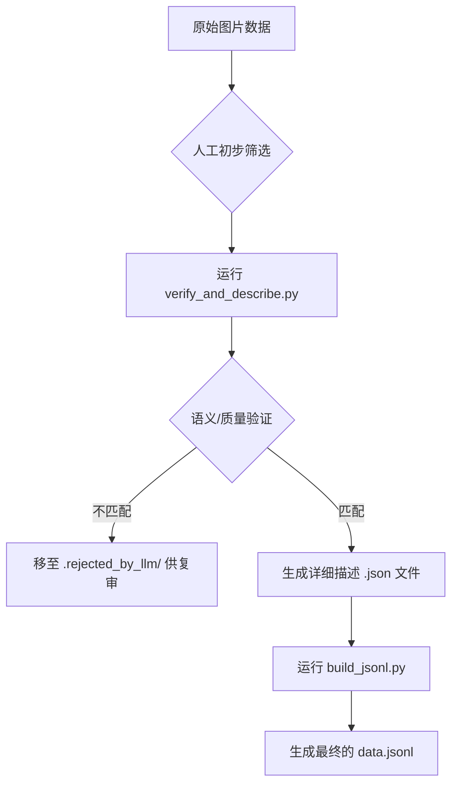

# LLM 驱动的数据集增强工具

本项目提供了一个利用多模态大语言模型（VLM，如 GPT-4V 或 Gemini）API 来自动化提升图像数据集质量的工具。

核心脚本 `verify_and_describe.py` 能够：
1.  **并发处理**: 利用多线程并发调用 VLM API，可通过 `--workers` 参数控制并发数，大幅提升处理速度。
2.  **语义验证**: 检查并确保目录中的每张图片都与其所属的类别（由父文件夹名定义）在语义上匹配。
3.  **灵活的目录支持**: `--root` 参数既可以指向包含多个类别的父目录（如 `datasets/diseases`），也可以直接指向单个类别目录（如 `datasets/diseases/Apple Scab Leaf`）。
4.  **质量评估与过滤**: 自动识别并隔离内容不符、质量低下（如截图、插画）的图片。
5.  **丰富化标注**: 为通过验证的图片生成比模板更自然、更详细的中英双语描述。

这个工具旨在作为现有数据处理工作流的一个重要补充环节，特别是在人工审核之后、生成最终标注文件之前，引入一层智能化的自动校验。

## 工作流



## 如何使用

### 第 1 步：安装依赖

该脚本依赖 `requests` 来调用 XMDBD 兼容的 OpenAI 接口，同时您也可以选择其它兼容客户端。

```bash
pip install -r requirements.txt
```

或者仅安装最小依赖：

```bash
pip install requests
```

### 第 2 步：配置 API 密钥

建议将您的 VLM API 密钥写入 `.env` 文件（该文件已在 `.gitignore` 中忽略，防止泄露），或者设置环境变量：

```bash
echo "VLM_API_KEY=sk-your-api-key-here" >> .env
echo "VLM_API_BASE=https://xmdbd.online/v1" >> .env
echo "VLM_MODEL=gemini-2.5-flash" >> .env
echo "VLM_WORKERS=8" >> .env
```

运行脚本之前执行 `export $(grep -v '^#' .env | xargs)` 载入变量，或者直接在终端中 `export VLM_API_KEY=...`。也可以通过命令行参数传入。

### 第 3 步：确认模型与终端点

默认已经集成了 XMDBD 站点的兼容接口：

- Base URL: `https://xmdbd.online/v1`
- 推荐模型：`gemini-2.5-flash`
- 通过 `--model`、`--api-base`、`--timeout` 等参数可以覆盖默认值。
- 如果服务端使用自签名证书，需要追加 `--insecure`（或设置 `VLM_VERIFY_SSL=false`）来跳过 TLS 校验。

### 第 4 步：运行脚本

在项目根目录下执行以下命令，对指定的数据集目录进行处理。

```bash
# 使用 8 个并发线程对 'datasets/diseases' 目录进行处理
# 不匹配的图片将被移动到 'datasets/diseases/.rejected_by_llm/'
python3 llm_tools/verify_and_describe.py \
    --root datasets/diseases \
    --workers 8

# 对单个类别目录进行“演练”，只打印日志而不移动文件
python3 llm_tools/verify_and_describe.py \
    --root "datasets/diseases/Apple Scab Leaf" \
    --action dry-run \
    --workers 4

# 如果您确认要直接删除不匹配的图片（危险操作！）
python3 llm_tools/verify_and_describe.py \
    --root datasets/diseases \
    --action delete \
    --workers 8
```

### 第 5 步：后续步骤

脚本运行完毕后：
1.  **（强烈建议）**人工复审 `.rejected_by_llm/` 目录中的图片，以防模型误判。
2.  对于通过验证的图片，其旁边会生成一个同名的 `.json` 文件，包含了 LLM 生成的详细描述。
3.  接下来，您可以修改 `scripts/build_jsonl.py` 脚本，使其在生成 `data.jsonl` 时，如果发现 `.json` 元数据文件存在，就优先使用其中更丰富的描述来代替模板生成的 Caption。

通过整合此工具，您的数据集将在质量和标注丰富度上得到显著提升。
